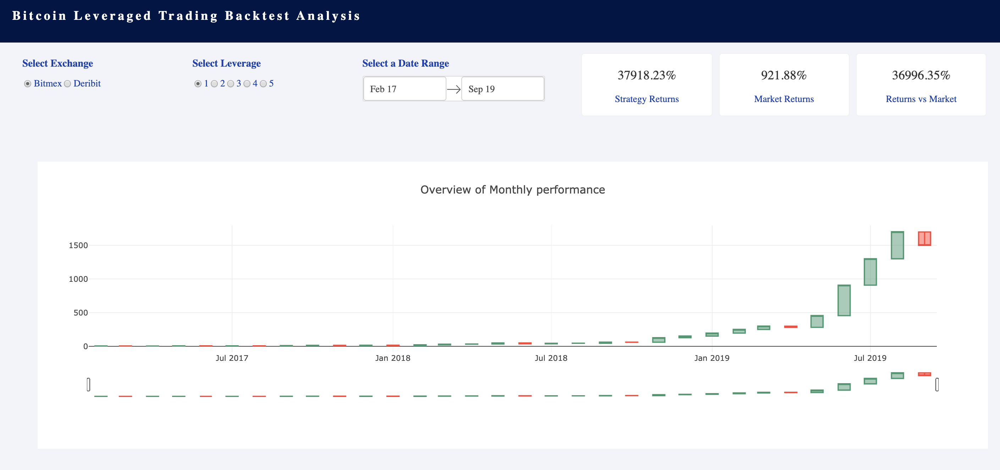
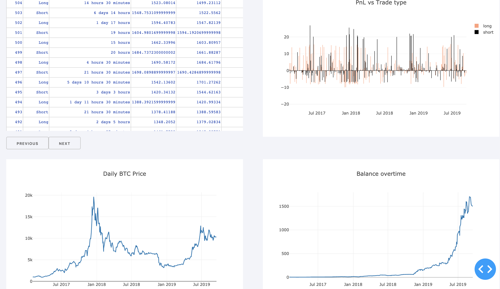

# Analyzing an Automated Bitcoin Trading Strategy 

DataScience for All (DS4)- Week 4 - Extended Case 4 - Marioceron

[Dashboards - Dash - Plotty- AWS - Data Visualization]

# Introduction:

As part of a crypto trading desk the analyzing an automated Bitcoin trading strategy is requested. 
The creator of the strategy has made historical data of the strategy available for this exercise. 
The task is to make an interactive dashboard that the firm can use to visualize the strategy's trades and performance.

# Source Files:
The following files are included in the project:
app.py - API using Flask; the Dashboard Python code using Dash and databse connection.
db_sql/database.sql : SQL for create database structure: trades table, database: stragegy, user: strategy_user
db_sql/aggr.sql:  SQL for Fill the trades table
requirements.txt: Requirements file generated for use on EC2 AWS instance.
nohup.txt : out file proof of running
img1.png, im2.png: Test Dashboard images.

# Usage
* To start the dashboard run `python app.py` 
then go to the address showed on the console.

# Example of Dashboard Generated:

